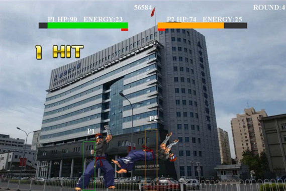
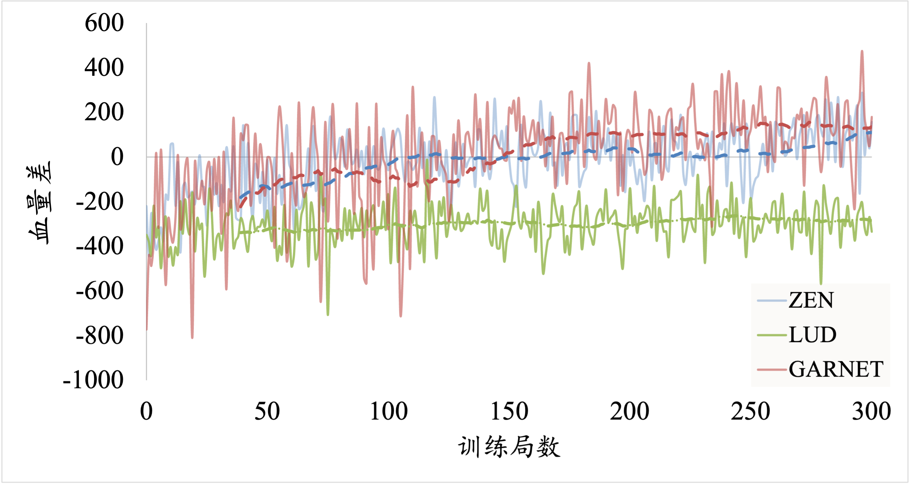
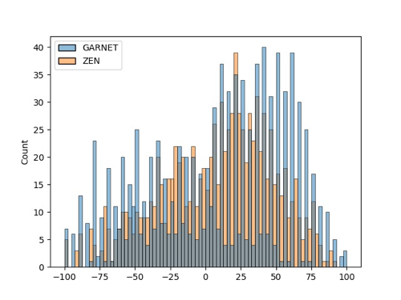

# 强化学习 格斗游戏 FightingICE game

国科大2022年春季学期强化学习大作业

Game Page: http://www.ice.ci.ritsumei.ac.jp/~ftgaic/index.htm

效果展示：[bilibili](https://www.bilibili.com/video/BV1x3411G7At?p=1&share_medium=android&share_plat=android&share_session_id=ecbeac57-a53f-4a98-b242-9283b555ddc4&share_source=WEIXIN&share_tag=s_i&timestamp=1654754460&unique_k=SEoJNms&vd_source=5b5c708fc6f16ba1e518ac2927c6e7aa) (感谢队友的配音)

论文报告：[Paper-fighting.pdf](./report/Paper-fighting.pdf)

PPT汇报：[FightingGames.pptx](./report/FightingGames.pptx)

原始数据：[original-data.xlsx](./report/original-data.xlsx)



使用角色：

|             ZEN             | GARNET |
| :-------------------------: | :----: |
|  |        |


## 1. Environment

This demo is based on Ubuntu 18 system.

Add java

```shell
sudo apt-get install openjdk-8-jre
```

If you have multi java:

```shell
sudo update-alternatives --config java
```

Add python

```shell
python = 3.8
pip install gym
pip install py4j
pip install port_for
pip install opencv-python
```

Close the screen in Linux

```shell
apt install -y xvfb
```

Run

```shell
Xvfb :2 -screen 0 1024x768x16 &
export DISPLAY=:2
```

Start the java server (modify the `ftg.sh` as Linux) and test. 
This is important on Linux

```shell
sh ftg.sh
```

More:

in `Ubuntu system` we need to modify `./data/characters/ZEN` to `./data/characters/Zen` (`Windows system` needn't)

注意，运行代码时候不要跑多个，即使修改端口4242也不行，虽然能运行，但很多指令传达不到，导致效果极差。

## 2. 基于SARSA的强化学习算法

标准赛道，对战双方初始血量都是400，1分钟限时情况下，剩余血量高者获胜。

由于状态是离散与连续共存，用$s$表示状态，其中$s \in \mathbb{R}^{144}$。
$s$主要包括自己的位置（连续信息），自己的动作（离散信息），对手的位置（连续信息），对手的动作（离散信息），以及双方能量条等。
通常可以通过离散连续变量的方法，或者使用神经网络的逼近器。这里我们使用$\mathcal{T}$对$s$进行变换，并通过贪心策略选择最佳动作

$$
a = \arg \max_a{\mathcal{T}(s)}
$$

其中，$\mathcal{T}$为一个线性映射，通过权重$w \in \mathbb{R}^{40 \times 144}$，则

$$
\mathcal{T}(s) = w \cdot s
$$

这样，通过线性映射的方式，可以间接表示Q值，则在SARSA的时序差分迭代中可以表示为

$$
w_{a_t} := w_{a_t} + \alpha \cdot (r + \gamma \cdot \mathcal{T}_{a_{t+1}}(s_{t+1}) - \mathcal{T}_{a_{t}}(s_{t})) \cdot s_t
$$

其中$s$表示状态，$a$表示动作,$r$表示奖励值，$w$代表线性权重。

## 3. 基于DDD的强化学习

具体内容请见原文[Paper-fighting.pdf](./report/Paper-fighting.pdf)。

## 4. 训练代码

其中，[fightingice_env.py](fightingice_env.py)文件被我修改，第40-43行，加入了变量`character`，这样可以自由从输入端选择`ZEN`，`LUD`和`GARNET`了。

训练：
```shell
python train.py\ 
    --RL-method SARSA\
    --player ZEN
```

测试也是一样，通用了

```shell
python test.py\
    --CKPT checkpoint/SARSA/ZEN/weight.npy\
    --player ZEN\
    --Rounds 100
```

测试DDD：

```shell
python test_Dual.py\
		--CKPT checkpoint/Duel/GARNET/ckpt.pt\
		--player GARNET\
		--Rounds 100
```

## 5. 测试结果

我们在人物ZEN和GARNET上进行了测试。

### 5.1 训练曲线



### 5.2 限时60s 的测试结果

为了消融验证DDD 模型架构的可行性，另给定SARSA 算法作为baseline，它仅仅将Q 函数改为一层线性映射，训练过程保持不变。限定比赛时间60 秒，限制双方HP 上限，测试100 轮后得到结果下表所示：

**角色ZEN：**

| 算法  | 胜率 |  HP差  | DPS  |
| :---: | :--: | :----: | :--: |
|  DDD  | 0.87 | 113.83 | 6.09 |
| SARSA | 0.52 |  0.81  | 3.48 |

**角色GARNET：**

| 算法  | 胜率 |  HP差  |  DPS  |
| :---: | :--: | :----: | :---: |
|  DDD  | 0.93 | 185.23 | 10.53 |
| SARSA | 0.77 | 115.16 | 9.79  |

### 5.3 HP 上限为100 的测试结果

为了验证DDD 算法在短期内的表现是否稳定，限定格斗过程中HP 上限为100，此时智能体只需8 次左右的有效攻击便可击败对方。1000 轮游戏中双方的游戏结果如下图所示。


